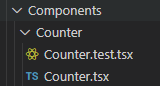

# Create React Lite

Creates a light, easy to use, opinionated but a customizable React project which supports TypeScript.

## The problem
The popular tool `create-react-app` from Facebook, creates a huge project with many features that developers are most likely never going to use.
Creation of a simple react project can take quite long (2 - 10 minutes depending on your cpu and connection) with unnecessary files, scripts.

## How create-react-lite solves the problem?
Create-React-Lite, creates a project in seconds (depending on your connection and cpu it may go between 20 to 40 seconds).
Current template is pretty much opinionated but more templates/setups will be coming.

## Requirement
Node JS should be already installed on your PC.

## Usage

Create your project via:

```sh
npx create-react-lite yourProjectNameHere
```

Navigate to your newly created project folder, then start:

```sh
npm start
```

## Features

- [x] TypeScript
- [x] CSS Modules
- [x] React-Testing-Library
- [ ] File Loader
- [ ] Webpack Setup for Prod & Development

## No Configuration needed

You do not have to setup TypeScript, Css Loaders or Babel to get going.

## Typescript

Your project will be setup with a loosened configuration of TypeScript. You can use all these formats in your project:

- .js
- .ts
- .jsx
- .tsx
  
## Styling

## Testing

Running Tests

```sh
npm test
```

Or

```sh
npm test --watch
```

Testing suite includes

- Jest
- Jest-TS
- React-Testing-Library
- JSDOM

You can start include your tests anywhere you want in your `src` folder.

Acceptable test file name extensions:

```sh
App.test.js
App.test.ts
App.test.jsx 
App.test.tsx (Most likely this is what you are going to need)
```

Example:



## File Loading
